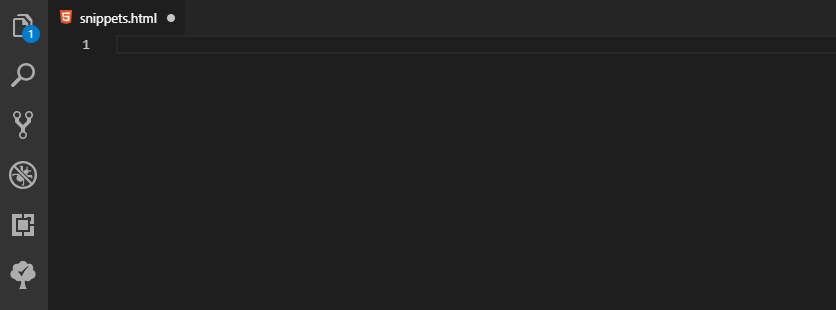
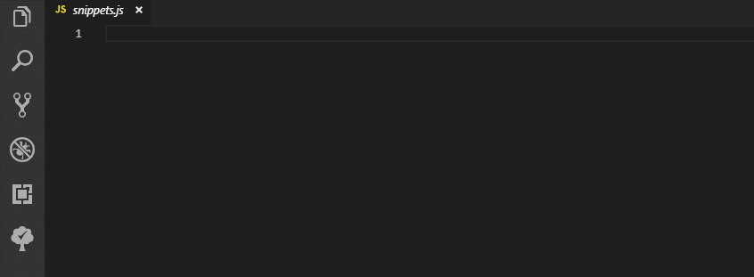

# HybridForms Snippets

[icomedias' HybridForms](https://www.icomedias.com/de/) HTML and JavaScript/TypeScript snippets.

All code snippets are based on and follow the official TemplateReferenceGuide and JavaScriptGuidance

# Usage

All snippets starts with "hf-". Type part of a snippet, press enter, and the snippet unfolds.

### hf-combobox

### hf-js

# Pro Tip

You don't need to type any dashes: "hfcustomcontrol" -> "hf-customcontrol" snippet

### HTML Snippets

Snippet  | Description
---------|-------------
hf-block | Creates an empty block container
hf-condition | Creates a block, area, tab, condition definition
hf-pagecondition | Creates a Page condition definition
hf-templatecondition | Creates a Template condition definition
hf-buttoncontrol | Creates a ButtonControl
hf-checkbox | Creates a Checkbox
hf-combobox | Creates a Combobox input field
hf-datepicker | Creates a Datepicker input field
hf-drawingcontrol | Creates a Drawingcontrol input field
hf-htmlcontainer | Creates a HtmlContainer input element
hf-inkcontrol | Creates a Inkcontrol input field
hf-label | Creates a Label
hf-mailbutton | Creates a Mail Button
hf-mapbutton | Creates a Map Button
hf-numericfield | Creates a NumericField input field
hf-phonebutton | Creates a Phone Button
hf-picturepicker | Creates a Picture Picker
hf-radiobox | Creates a RadioBox input field
hf-reversegeolocatorbutton | Creates a Reverse Geolocator Button
hf-selectbox | Creates a Selectbox
hf-signature | Creates a Signature input field
hf-textfield | Creates a Text input field
hf-textarea | Creates a textarea
hf-timepicker | Creates a Time Picker input field
hf-treeview | Creates a TreeView
hf-webview | Creates a Webview

### JavaScript Snippets

Snippet | Description
--------|-------------
hf-js | Custom Javascript starting point
hf-customcontrol | JavaScript derived Custom Control
hf-onchange | JavaScript onChange event handler
hf-set | Get and set values
hf-ctrl | Get a control
hf-field | Get a field
hf-repeating | Get post fix of a repeating unit

### TypeScript Snippets

Snippet | Description
--------|-------------
hf-ts | Custom TypeScript starting point
hf-customcontrol | JavaScript derived Custom Control
hf-onchange | JavaScript onChange event handler
hf-set | Get and set values
hf-ctrl | Get a control
hf-field | Get a field
hf-repeating | Get post fix of a repeating unit
hf-user | Get current display name of user and write it to control by given id
hf-signer | Add field values to Signature by given comma serperated ids

### Extended Snippets

These snippets must be executed in all specified file types in order to obtain all the necessary code parts and the desired functionality!

Snippet | File Types | Description
--------|------------|-------------
hf-repeatinginput | HTML, SCSS, TS | Add RepeatingInput to project
hf-initializr | HTML, TS | Add Initializr block to file